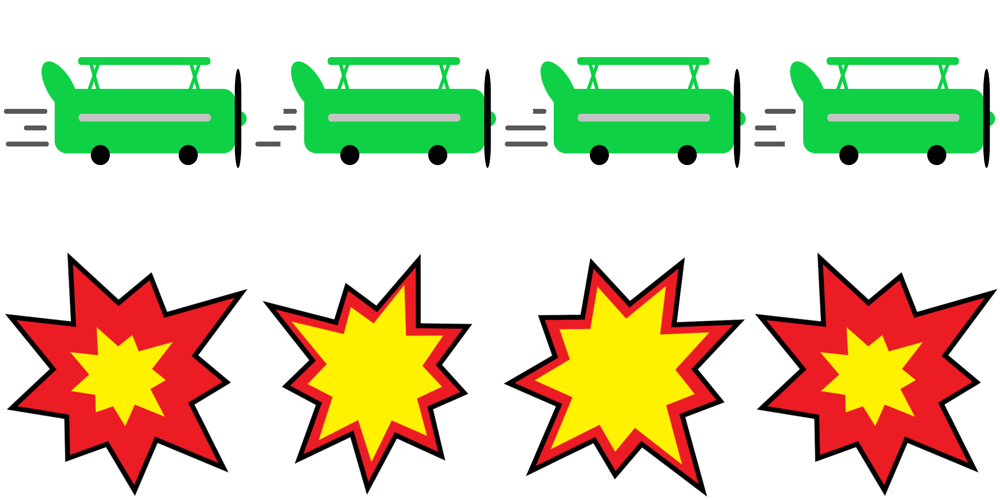
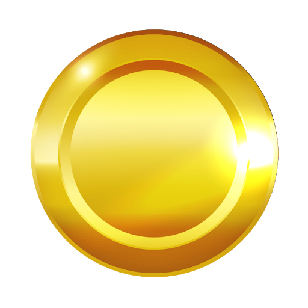

# Treasure Hunter
> This is a game where you play the role of an airplane and collect as many coins as possible without getting struck by the obstacles(lightning bolts).

## Game Design and Instructions

- Play as a plane collecting coins and avoiding obstacles.
- Collect gold coins to increase your score.
- The only way to survive is to avoid crashing to the obstacles(lightning bolts) to not lose the game.

### Game Controls

To control the plane, do a mouse click or tap on the screen if you are using a touchscreen device.

- Click/Tap up to move the plane upwards.
- Click/Tap in the middle to move plane to the center.
- Click/Tap down to move the plane downwards.

For detailed information about the game please check the [Game Design File(GDD)](https://github.com/SamArsanios/treasure-hunter/blob/game/docs/game-design.txt).

### Assets

|Asset                                      |Description                            |
|-------------------------------------------|---------------------------------------|
|          |Gameplay Sky Background|
| |Plane and Explosion Spritesheet   |
||Coin/Treasure that the plane can collect                       |
|       |Obstacle that the player needs to avoid |

## Built With

- Phaser 3 
- JavaScript
- LeaderBoard API
- Jest

## Live Demo
[Project Link](https://peaceful-tereshkova-883d6e.netlify.app/)

## Getting Started

To get a local copy up and running follow these simple steps.

- Run `git clone git@github.com:SamArsanios/treasure-hunter.git` in your terminal to clone this repo.
- `cd treasure-hunter`
- Install the necesarry dependencies by running `npm install`.
- Run `npm run start` to view the game in your default browser.

To run the test

- Run `npm test` to run the tests.

## Author

👤 **Samson**

- Github: [@SamArsanios](https://github.com/SamArsanios)
- Twitter: [@SamArsanios](https://twitter.com/SamArsanios)
- LinkedIn: [@Samson](https://www.linkedin.com/in/samson-kibrom/)

## 🤝 Contributing

Contributions, issues, and feature requests are welcome!

## Show your support

Give a ⭐️ if you like this project!

## Acknowledgments

- To Microverse for their `README` template.
- To creators of [Paint3D](https://www.microsoft.com/en-us/p/paint-3d/9nblggh5fv99?activetab=pivot:overviewtab) that allowed me create 2D objects and images instantly.
- To the creators of [Texture Packer](https://www.codeandweb.com/texturepacker) and [Physics Editor](https://www.codeandweb.com/physicseditor) for their great softwares that helped me create,edit and export all the spritesheets of the game.
- To [OpenGameArt](https://opengameart.org/) for the background music used in the game.
